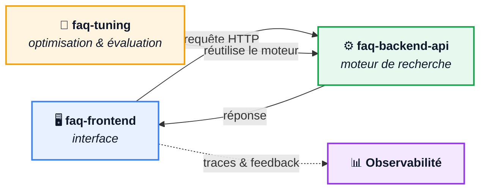

# FAQ — Assistant de recherche sémantique dans une FAQ

Un assistant qui comprend les questions posées en langage naturel (et dans plusieurs langues) et retrouve la réponse la plus pertinente dans la FAQ de la Guild Open Tech. Lorsqu'il n'est pas assez sûr de lui, il préfère **s'abstenir** ou proposer plusieurs pistes plutôt que de donner une mauvaise réponse.

Le projet couvre toute la chaîne : un moteur de recherche exposé via une API, une interface de test pour les utilisateurs, et un outillage d'optimisation et d'évaluation pour mesurer et améliorer la qualité des réponses.



## Fonctionnalités globales

- **Recherche par le sens, pas par mots-clés** : une question reformulée différemment, ou posée dans une autre langue, retrouve la bonne entrée de la FAQ.
- **Réponses fiables et nuancées** : le système classe les réponses candidates, mesure sa confiance et distingue trois situations : réponse claire, plusieurs réponses plausibles, ou question hors périmètre.
- **Seuils de confiance réglables** : le niveau d'exigence peut être ajusté à chaque requête.
- **Consultation de la FAQ complète** : l'ensemble des questions et réponses reste accessible.
- **Retour utilisateur** : chaque réponse peut être notée (OK / KO, avec commentaire) pour alimenter l'amélioration continue.
- **Amélioration pilotée par la mesure** : les paramètres du moteur sont optimisés automatiquement sur un jeu de questions annotées, et chaque configuration est évaluée de façon reproductible.

## Backend

### `faq-backend-api` — le moteur de recherche

API REST qui constitue le cœur du système. Au démarrage, elle charge la FAQ et transforme chaque formulation en représentation vectorielle. À chaque question, elle :

1. recherche les formulations les plus proches sémantiquement ;
2. regroupe les résultats par thème ;
3. affine le classement avec un second modèle de comparaison plus précis ;
4. décide de répondre, de proposer plusieurs candidats ou de s'abstenir, selon des seuils de confiance.

Elle expose la recherche de réponse, la liste complète de la FAQ, sa configuration courante et un contrôle de santé, avec une documentation interactive générée automatiquement. Elle est conteneurisée et déployée sur Hugging Face Spaces.

## Frontend

### `faq-frontend` — l'interface de recherche

Application web de type chat, qui interroge l'API déployée. L'utilisateur pose sa question et obtient la réponse, accompagnée des formulations candidates et de leurs scores de pertinence. Elle permet de :

- ajuster les seuils de confiance à la volée pour expérimenter ;
- parcourir la FAQ complète ;
- donner un feedback sur chaque réponse ;
- tracer chaque échange pour analyser l'usage et la qualité en production.

C'est à la fois une démonstration du produit et un outil de recueil de retours pour nourrir le tuning.

## Qualité / MLOps

### `faq-tuning` — optimisation et évaluation

Atelier qui permet de **mesurer et d'améliorer** la qualité du moteur sans le modifier. Il rejoue un jeu de questions annotées sur le vrai moteur de l'API (mêmes classes, mêmes modèles que la production) et :

- **recherche automatiquement les meilleurs réglages** (seuils de similarité et de confiance, nombre de candidats…) en lançant des dizaines d'essais comparés ;
- **suit chaque expérience** (paramètres, taux de bonnes réponses, graphiques d'importance des paramètres) pour comparer les essais et garder l'historique ;
- **évalue une configuration donnée** sur un dataset de référence partagé, avec des indicateurs métier : taux de bonnes réponses, taux de réponse, faux positifs.

### Boucle d'amélioration continue

1. **Observer** : l'interface trace chaque échange et recueille le feedback des utilisateurs (Langfuse).
2. **Mesurer** : un dataset d'utterances annotées sert de référence pour calculer la précision du moteur.
3. **Optimiser** : Optuna explore les réglages, MLflow garde la trace de chaque essai.
4. **Valider** : LangSmith compare les configurations entre elles sur les mêmes exemples avant de les reporter dans l'API.

## Tester le projet

### API (déployée)

Base URL : **https://loren-faq-backend-api.hf.space**

| Usage | URL |
|---|---|
| Documentation interactive (Swagger) | https://loren-faq-backend-api.hf.space/docs |
| Poser une question (`POST`) | https://loren-faq-backend-api.hf.space/ask |
| Santé du service | https://loren-faq-backend-api.hf.space/health |
| Configuration courante | https://loren-faq-backend-api.hf.space/config |
| FAQ complète | https://loren-faq-backend-api.hf.space/list |

```bash
curl -X POST "https://loren-faq-backend-api.hf.space/ask" \
  -H "Content-Type: application/json" \
  -d '{"question": "Comment je deviens membre de l'association ?"}'
```

Les seuils (`similarity_threshold`, `top_k`, `cross_encodeur_gap_threshold`, `cross_encodeur_confidence_threshold`) peuvent être ajoutés au corps de la requête pour surcharger les valeurs par défaut.

> L'espace Hugging Face peut être en veille : la première requête prend alors quelques dizaines de secondes (chargement des modèles).

### Application (interface)

URL de l'application : **https://huggingface.co/spaces/Loren/faq-frontend**

Pour la lancer en local, en pointant sur l'API déployée :

```bash
cd faq-frontend
pip install -r requirements.txt
python app.py
```

### Tuning et évaluation (en local)

```bash
cd faq-tuning
pip install -r requirements.txt
python tune.py --n-trials 50          # optimisation Optuna
mlflow ui --backend-store-uri ./mlruns  # résultats sur http://localhost:5000
python langsmith_evaluate.py          # évaluation LangSmith (clé API requise, voir .env.example)
```

## Stack technique

### Backend (`faq-backend-api`)

- **Python** : langage du projet
- **FastAPI** : framework de l'API REST
- **Uvicorn** : serveur ASGI
- **Pydantic** : validation des requêtes et réponses
- **ChromaDB** : base de données vectorielle
- **Sentence-Transformers / PyTorch** : embeddings `multilingual-e5-small` et cross-encoder de reranking `ms-marco-MiniLM-L6-v2`
- **Docker** : conteneurisation de l'API
- **Hugging Face Spaces** : déploiement de l'API

### Frontend (`faq-frontend`)

- **Python** : langage de l'application
- **Gradio** : interface de chat
- **Requests** : appels vers l'API
- **Hugging Face Spaces** : déploiement de l'interface

### Qualité / MLOps (`faq-tuning`)

- **Optuna** : optimisation des hyperparamètres
- **MLflow** : suivi des expériences
- **LangSmith** : évaluation sur dataset
- **Langfuse** : observabilité et feedback utilisateur (depuis l'application)
- **Plotly** : visualisation des résultats
- **pandas** : manipulation des données d'évaluation
